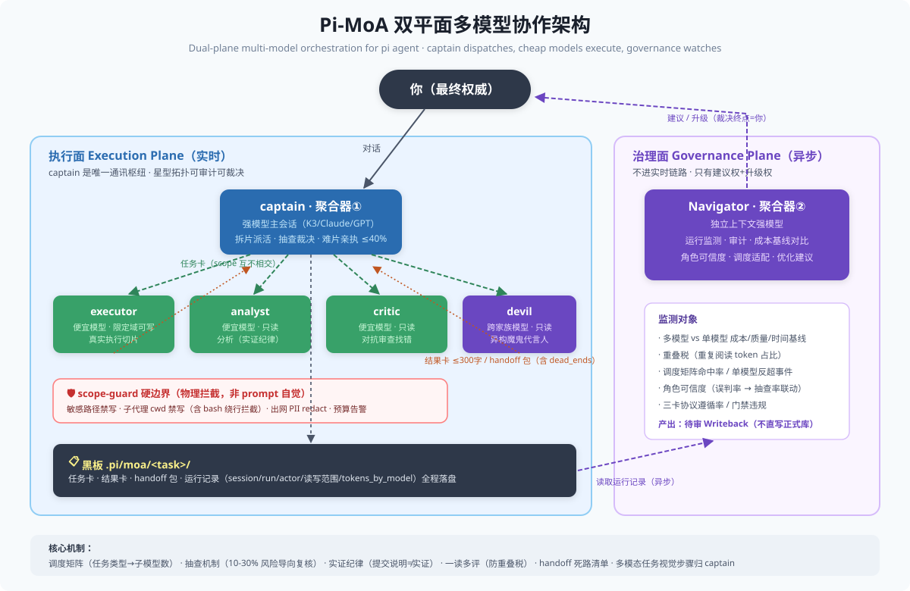

# Pi-MoA 🐙

**Multi-model orchestration for the [pi coding agent](https://github.com/earendil-works/pi-mono): one captain model dispatches, cheap sub-models execute, an independent governance plane watches.**

让 pi 变成一个"教练兼队员"的多模型系统：强模型（如 Kimi K3 / Claude / GPT）做调度、裁决与最难的切片；便宜模型（DeepSeek / Haiku 等）并行承包分析与执行；所有通讯走"任务卡 / 结果卡 / handoff 包"三卡协议，全程可审计。

[English](docs/README.en.md) · [架构](docs/architecture.md) · [配置](docs/configuration.md) · [模式（playbooks）](docs/playbooks.md)

## 为什么

- 编码会话里 40-60% 的 token 是"搜索、机械修改、格式化"——不该让旗舰模型干
- 单模型长会话必撞上下文墙（实测：单会话 90 万+ token 后 compaction 直接失败）
- 多模型意见集成（MoA）需要**真异构**才有效：同模型多角色要配对抗 prompt + 独立上下文 + 跨家族审查
- 纯路由不够：还需要安全硬边界、质量门、成本基线对比

## 30 秒理解架构



```
你
 ▼
captain（强模型, pi 主会话）── 拆片/派活/抽查/裁决
 ├─ executor    (便宜模型, 限定域可写)  ← 真实执行切片
 ├─ executor-k3 (高能力档, 限定域可写)  ← 设计型/高难度分片
 ├─ analyst     (便宜模型, 只读)        ← 分析
 ├─ critic      (便宜模型, 对抗立场)     ← 审查 diff / 找错
 └─ devil       (跨家族模型, 只读)       ← 异构魔鬼代言人
      │ 结果卡 / handoff 包（星型拓扑，全经 captain）
      ▼
 任务记录 .pi/moa/<任务名>/  ← 全程留痕，Navigator（navigator-watch）异步审计
```

安全硬边界（scope-guard，物理拦截而非 prompt 自觉）：
敏感路径禁写 · 子代理禁写工作目录外（含 bash 绕行拦截）· 出网 payload PII 自动打码 · 会话 token 预算告警 · 任务记录结果卡单写者（文件名须含 actor 名，共享文件仅 captain 可写）

## 快速开始（5 分钟）

前置：已安装 [pi](https://github.com/earendil-works/pi-mono)，且任一模型 provider 可用。

```bash
git clone https://github.com/Flipped929/pi-moa.git && cd pi-moa
./install.sh                      # 幂等，自动备份
pi                                # 打开 pi
/moa-on                           # 开启协同模式（快捷命令）
/moa-status                       # 查看状态：三层排版（captain·调度 / Navigator·监测审计 / 子模型，含 token/时长）+ 角色在线检查
```

命令一览：`/moa on|off|status|review <主题>`，或快捷别名 `/moa-on` `/moa-off` `/moa-status` `/moa-review <主题>`。

然后把 `examples/demo-review/c.py` 放进一个测试目录，对 pi 说：

> 评审当前目录的 c.py，派 analyst 和 critic 并行审查，汇总裁决。

预期：captain 建任务记录、并行派活、critic 找出 2 个必崩 bug、终稿落盘 `.pi/moa/`。

## 模型 roster（换成你手里的模型）

默认：`executor/analyst/critic = deepseek-v4-flash`，`executor-k3/devil/captain = kimi-k3`（executor-k3 是 K3 高能力执行档，主领设计型/高难度分片）。
改 `~/.pi/agent/agents/*.md` 的 `model:` 字段即可——架构不绑定厂商，只要求：
- captain 用你最强的模型（长上下文优先）
- devil 用与执行层**不同家族**的模型（异构才有意义）
- 含图任务永远走多模态模型（子模型纯文本）

## 核心概念

| 概念 | 一句话 |
|---|---|
| 三卡协议 | 任务卡（含写权限 scope）/ 结果卡（≤300字+产物路径）/ handoff 包（含 dead_ends 死路清单） |
| 调度矩阵 | 任务类型决定子模型数量：高重叠阅读 0-1 个 / 编码 2-3 并行 / 评审满编 3 |
| 抽查机制 | captain 对子模型实证风险导向抽查 10-30%，一处误判→全量复核+信任降级 |
| 实证纪律 | git 提交说明、注释、"验证通过"字样不算实证，必须验代码本体 |
| 重叠税 | 多个子模型重读同一材料的 token 浪费——用"一读多评"规避 |
| Navigator | 异步治理面：监测角色可信度/重叠税/多模型 vs 单模型成本基线，产出优化建议 |
| navigator-watch | 任务记录纪律的结构性强制：派活（subagent）/ git commit·push 前须已落盘任务卡，否则物理拦截；turn_end 每 5 轮对账（漏记 commit / 缺 status 结果卡）并告警 |
| 结果卡写权限 | 子代理写 .pi/moa 内路径须文件名含自身 actor 名（results/xx-<actor>.md）单写者；共享文件（task.md/final.md 等）仅 captain 可写 |
| /moa status 三层 | captain·调度（token/成本） / Navigator·监测审计（对账告警状态） / 子模型（在跑 + 已完成任务与时长） |

## 实测数据

在真实企业级项目上的三次实战对比（MoA vs 单模型影子基线，质量/成本/时间三维）：**[docs/evaluation.md](docs/evaluation.md)**
- 全文档审计：单模型完胜（重叠税 2.6x）→ 催生调度矩阵
- 机械修改：打平 → critic 改抽样触发
- 双模块并行开发：MoA 首胜，critic 抓出致命 bug

## 参与共建（Help Wanted）

这个项目最希望社区帮忙的方向：**聚合模型如何调度子模型**——

- 🧠 **数量决策**：几路并行最优？什么信号决定加/减一路？
- ✂️ **任务分配**：按文件/模块/依赖图切片，哪种返工率最低？
- 📏 **重叠度量化**：如何自动测算并把重叠税前置拦截？
- 🎯 **抽查率动态化**：角色可信度如何随误判率贝叶斯更新？

完整问题清单与现有实测数据见 [docs/evaluation.md](docs/evaluation.md)（含 6 个开放问题）。
有好想法 → 开 issue；有实验数据 → PR 到 evaluation.md。

## 目录

```
extensions/   pi 扩展（moa-mode 调度 / scope-guard 安全 / navigator-watch 监测 / subagent 派生）
agents/       角色定义（executor / executor-k3 / analyst / critic / devil）
moa/          三卡模板 + guard-policy 策略示例
examples/     demo-review 五分钟演示
docs/         架构 / 配置 / 模式编写指南
install.sh / uninstall.sh
```

## 状态

v0.1.0 — 核心链路已在真实项目验证（多模块并行开发 + 文档审计 + 安全脱敏场景）。
路线图见 [CHANGELOG.md](CHANGELOG.md)。欢迎 issue 与 PR。

## License

MIT（`extensions/subagent/` 基于 pi 官方 example 修改，版权归原作者所有）
